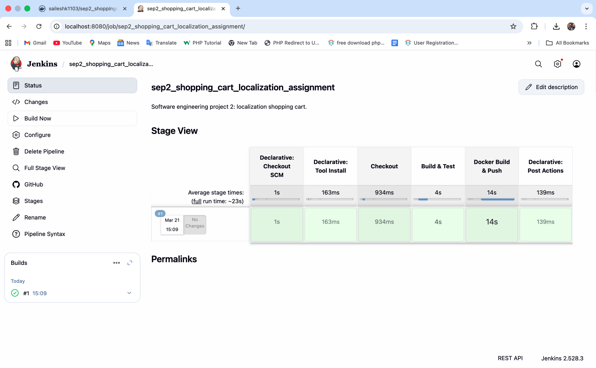
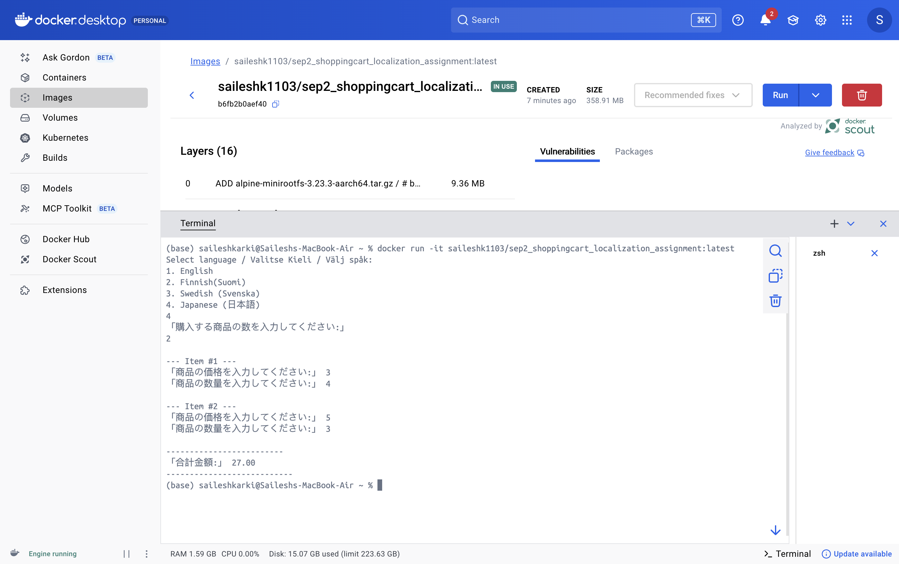

# Shopping Cart Localization Application
**SEP2 (Week 1) | Java Console Application with Localization & CI/CD**

## 🛒 Project Overview
A Java-based shopping cart application designed to demonstrate **Localization (i18n)**, **Unit Testing (JUnit 5)**, and **DevOps automation** using Jenkins and Docker. The application calculates the total cost of items while supporting multiple languages and strict UTF-8 encoding.

## 🚀 Key Features
* **Multi-Language Support**: Supports English, Finnish (Suomi), Swedish (Svenska), and Japanese (日本語).
* **UTF-8 Focused**: Fully compatible with non-Latin characters (Kanji/Kana) across all environments.
* **Logic Separation**: Calculation logic is isolated for 100% Unit Test coverage.
  * **CI/CD Pipeline**: Automated build, test, and deployment via Jenkins.

* **Multi-Platform Docker**: Built for both `amd64` (Intel/AMD) and `arm64` (Apple Silicon) to ensure compatibility with **Play with Docker**.

## 🛠️ Tech Stack
* **Language**: Java 21 (GraalVM/OpenJDK)
* **Build Tool**: Maven 3
* **Testing**: JUnit 5 & JaCoCo (Code Coverage)
* **Automation**: Jenkins (Pipeline-as-Code)
* **Containerization**: Docker & Docker Compose
* **Deployment**: Docker Hub

## 📊 Code Coverage
The core business logic (`calculateItemTotal`) is verified with **100% branch and line coverage** using JaCoCo.
* **Total Methods Tested**: 100%
* **Total Lines Covered**: 100% (Logic Class)

## 🐳 Docker Usage
The image is hosted on Docker Hub: `saileshk1103/sep2_shoppingcart_localization_assignment`

### Run with Docker:
```bash
docker run -it saileshk1103/sep2_shoppingcart_localization_assignment:latest